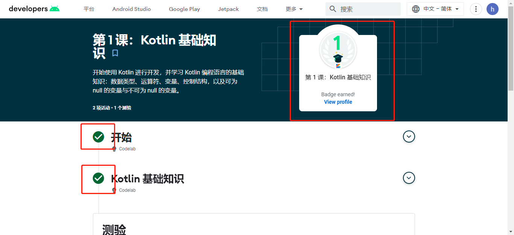
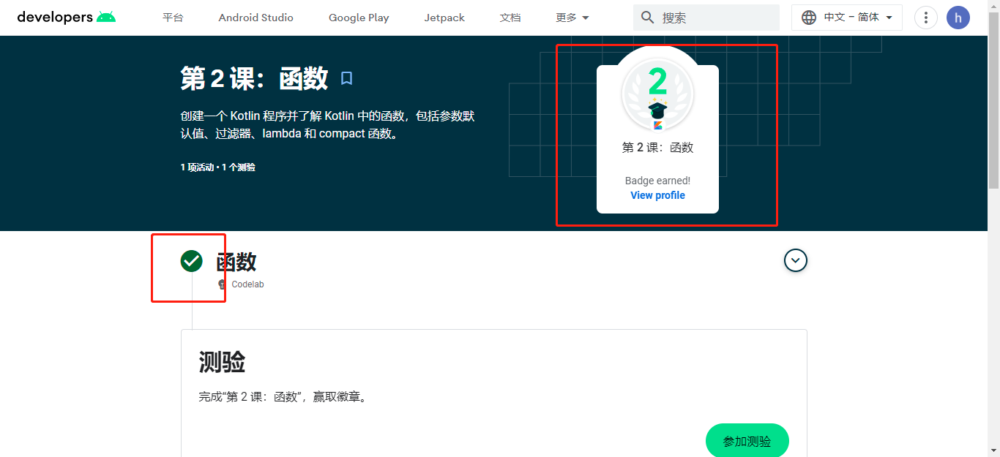
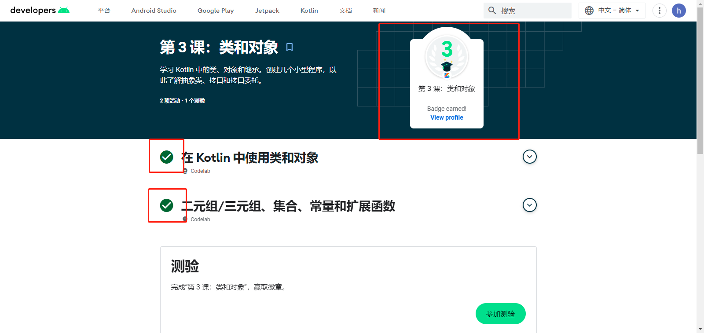
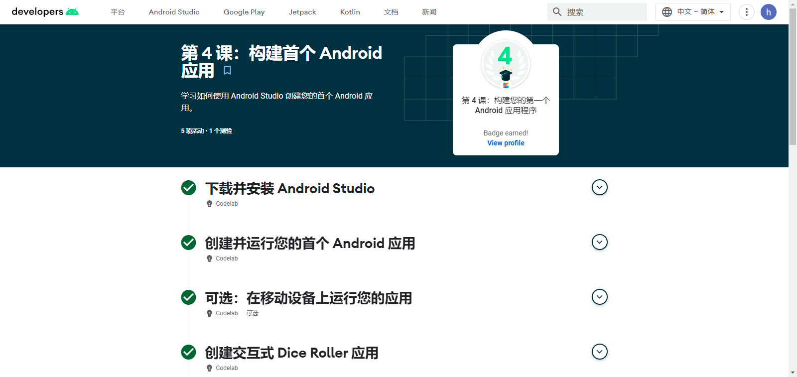

# Smart-Mobile-Development

智能移动开发(Codelab和徽章截图)

##### 第 1 课：Kotlin 基础知识

##### 第 2 课：函数

##### 第 3 课：类和对象

##### 第 4 课：构建首个 Android 应用

##### 第 5 课：布局的徽章和实验代码截图见文件夹lab02

##### 第 6 课：应用导航的作业见文件夹lab03
