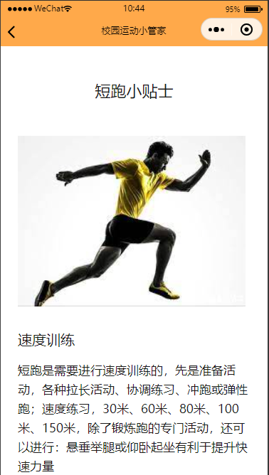

#### 校园锻炼运动小管家小程序介绍文档(迭代二)

1. ##### 作品概述

   1. 小程序说明介绍

   >本小程序为在校学生提供一个锻炼运动的综合平台。本小程序支持运动信息分享、邀请附近的同学一起运动、查看运动小贴士、制定运动计划表、查看近期的运动信息等等。

   2. 应用场景

   >本小程序将会应用在大学校园中，在校的学生将会是本小程序的主要服务对象。本小程序致力于为在校学生提供更好的锻炼运动体验并鼓励在校学生加强体育锻炼。

   3. 解决的实际问题

   | 问题描述                                                     | 解决方案                                                     |
   | ------------------------------------------------------------ | ------------------------------------------------------------ |
   | 解决在校学生因为锻炼没有计划导致的懈怠问题**(迭代一已解决)** | 校园锻炼运动小管家小程序将会在小程序首页为每一个用户提供一个运动计划表。用户可以在计划表上添加今日需要完成的锻炼计划。用户每完成一项锻炼计划便可以在该运动计划表所对应的条目上打勾。用户可以非常轻松地查看运动计划表上的计划有没有完成。这样非常有利于督促学生们进行体育锻炼。 |
   | 解决想要结伴锻炼但却找不到运动伙伴的问题**(迭代一已解决)**   | 校园锻炼运动小管家小程序将会为用户提供运动邀请的功能。用户如果想要结伴一起锻炼的话，可以在小程序的邀请界面，寻找附近的邀请并且接受邀请便可以找到运动伙伴。如果用户经过筛选，发现附近的锻炼邀请没有满意的话，可以自己发起锻炼邀请，等待他人接受。 |
   | 解决学生缺乏科学的运动方法问题**(迭代二已完成)**             | 在校学生经常有人因为运动过度而造成身体损伤，校园锻炼运动小管家小程序将会提供一个运动知识分享的小贴士界面。小贴士界面将会展示一些运动的科学方法，例如慢跑、短跑、瑜伽、足球、排球等，帮助在校学生学习科学的运动方法。 |
   | 解决无法科学方便统计自身运动数据问题                         | 小程序将会提供一个页面来展示用户最近的运动信息统计数据。用户可以轻松地实现对自身运动数据的分析。 |
   | ...                                                          | ...                                                          |

2. ##### 产品设计

   * 小程序主页**(迭代一已完成)**
     * 
     
     * 小程序总体使用黄蓝色调，小程序主页上方区域将会显示用户的头像，用户的昵称以及用户的今日运动步数。主页的下方将会显示一个运动计划表。运动计划表拥有一个添加计划按钮，点击即可添加新的运动计划。每当完成一个锻炼计划时就可以点击计划项前方的圆形按钮对计划进行打勾来表示完成。当小程序切换页面或者是小程序退出时，运动计划表就会将打勾的运动计划项自动删除。
     
     * 小程序主页功能用例图
     
       
     
   * 运动邀请界面 **(迭代一已完成)**
     * 
     * 运动邀请页面会列出附近的暂时没有人接受的运动邀请(如第一个图所示)。点击运动邀请的查看详情按钮，即可查看到运动邀请的详细信息，包括运动邀请人的昵称、邀请发起时间、邀请运动的项目以及邀请人的大概位置信息(如第二个图所示)，并可以接受运动邀请。如果用户想要发起运动邀请来邀请别人来一起运动的话，可以使用运动邀请界面的发起邀请功能，点击运动邀请界面主界面上方的发起邀请按钮，即可跳转到发起运动邀请界面(如第三个图所示)并发出运动邀请。
     * 运动邀请界面功能用例图
     
     
     
   * 运动小贴士界面**(迭代二已完成)**
     
     * 
     * 运动小贴士界面会以列表的形式展示出数据库中存有的小贴士。每一个运动小贴士在小程序页面中会展示出该运动的图片、该运动的名称以及该运动的简要介绍。点击每一个运动小贴士项下方的显示小贴士详情页面按钮，即可查看运动小贴士的完整内容。运动小贴士详情界面由两部分组成，一部分是运动小贴士的标题，另一部分是运动小贴士的内容。运动小贴士详情界面的内容是有很多各项组成的，每个项包括一张图片、一个小标题和一段文字介绍。小程序每次进入运动小贴士详情界面，就会从数据库中获取这些内容项。小程序将这些内容项的每一项按照图片、小标题和文字的顺序依次渲染到页面上，最终形成了运动小贴士的完整详情介绍页面。
     * 运动小贴士界面功能用例图
     
     
     
     
     
   * 用户界面**(迭代二已完成)**
     * 
     * 小程序的用户界面相对来说比较简洁。小程序用户界面的上方包括用户的头像和昵称，下方包括一些必要的功能按钮。这些功能按钮包括我发出的运动邀请、我接受的运动邀请和近期的运动数据统计，点击对应的按钮后会跳入相应的页面。
     * 用户界面功能用例图
     
     
     
     
     
   * 用户运动信息数据统计界面**(计划迭代三完成)**
     * 正在开发完善中
     
   * 用户发出和接受的邀请查询管理界面**(计划迭代三完成，迭代二提前完成)**
     * 
     * 上面两幅图分别是用户发出和接受的邀请查询管理界面。用户发出的锻炼邀请查询界面可以看到已接受和等待接受的锻炼邀请。等待接受的锻炼邀请将会显示为红色，已接受的要锻炼邀请将会被显示为浅红色。查询界面中的所有邀请将会按照时间顺序排列。并且点击邀请上的查看详情就可以查看邀请的详细信息。
     * 用户发出和接受的邀请查询管理界面功能用例图
     
     
     
     

3. ##### 技术实现方案(需后续迭代完善)

   * 小程序端
   
     * 总览
   
       * 校园运动小管家小程序没有使用任何第三方框架，使用的组件均为微信的原生组件。页面所显示的样式均使用CSS渲染。
   
       * 用户的头像和昵称还有用户每日的运动数据，使用微信的API开放接口获取。
       * 使用微信的API开放接口，获取用户的位置信息，并使用微信的原生组件map将地图绘制出来显示在邀请详情里。
     * 小程序主页Page参数对象类图(由于Page的参数对象为匿名对象，所以类名用Object表示)
   
       * 
       * data属性记录运动步数、用户信息计划项等信息
       * onShow执行时会调用getUserSportPlans向云端服务器发起获取用户锻炼计划的请求
       * onHide执行时会删除被打勾的计划项选项
       * getWeRunData获取微信运动步数
       * getAuthorityAndWeRunData在获取授权的情况下调用getWeRunData
       * getUserData获取用户信息
       * getUserSportPlans获取用户锻炼计划
       * updateSportPlans更新用户锻炼计划
       * getInput，addNewPlan，clickRadio均为事件处理函数
     * 运动邀请界面Page参数对象类图(由于Page的参数对象为匿名对象，所以类名用Object表示)
     
       * 
       * 标注为exercise的类接口说明
         * onLoad和onShow用于邀请数据的加载
         * onPullDownRefresh目前为空
         * refreshInvitionList刷新邀请数据
         * clickButtonToInvite，clickToLookDetail为点击事件，进行页面体跳转
       * 标注为invitedetail的类接口说明
         * onLoad和onShow用于初始化邀请详细信息
         * getInviteePhoneNumber，clickAcceptInvition为事件处理函数
       * 标注为invition的类接口说明
         * onLoad获取用户信息并初始化界面
         * 其他接口均为事件处理函数
     * 运动小贴士界面Page参数对象类图(由于Page的参数对象为匿名对象，所以类名用Object表示)
     
       * 
       * 标注为tips的类接口说明
         * onLoad和onShow调用getTipsFromDatabase加载小贴士数据
         * onPullDownRefresh，onReachBottom刷新小贴士数据
         * clickToLookTipDetail为点击事件处理函数，用于页面跳转
         * getTipsFromDatabase获取云端数据库中的小贴士数据
       * 标注为tipsdetail的类接口说明
         * onLoad和onShow用于获取小贴士详细文章数据并加载
     * 用户界面Page参数对象类图(由于Page的参数对象为匿名对象，所以类名用Object表示)
     
       * 
       * onLoad加载用户数据并渲染界面
       * 其他接口均为事件处理函数，用于页面跳转
     * 用户发出和接受的邀请查询管理界面Page参数对象类图(由于对应界面的配置参数对象只含有一个onload方法和必要的点击事件处理函数，所以就不再画类图了)
   * 后台服务器端
     * 使用微信云开发来为微信小程序提供后端的服务支撑。
     * 使用云开发中的云数据库来为微信小程序提供数据持久化存储的能力。

##### 迭代一完成的功能总结：

* 用户运动步数实时获取显示功能
* 运动计划表功能，可实现对运动项的添加、打勾删除
* 附近的运动邀请显示功能
* 发起运动邀请功能
* 运动邀请查看详情功能
* 运动邀请接受功能

##### 迭代二完成的功能总结

* 完成了运动小贴士列表主界面
* 完成了查看运动小贴士详情的文章界面
* 修复了接受邀请时不输入手机号也可以点击接受按钮的bug
* 完成了用户界面的搭建
* 完成了发出和接受的锻炼邀请的查询管理界面
* 完成了发出和接受的锻炼邀请的查询详情界面